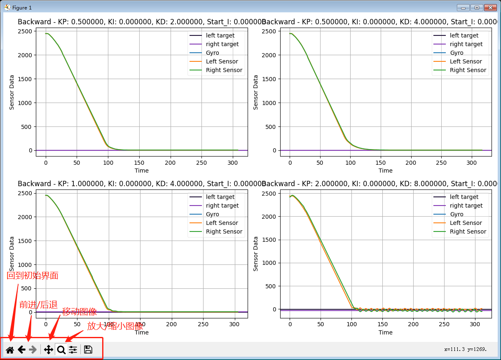

# 如何整定PID参数
 请参考```程序使用说明.pdf```中有关PID参数的整定方法
# 如何快速整定pid参数
## 保存PID数据到sd卡
要想快速并准确地整定PID参数，利用图像查看pid曲线是非常重要的。在本代码中预留有相关接口用于保存pid数据。以下是调用该接口的方法
```cpp
chassis.set_pid_logger(true);
```
在调用本函数后，每次执行pid指令时，都会将数据保存到内存卡中。文件名为：
```
模式_P_I_D_Start_i.txt
```
我们只需要在调试后将内存卡上的数据拷贝到本项目的```/scrpit```目录中，而后双击运行```draw_pid_curve.exe```，即可将拷贝过来的数据绘制成图像。图像会在数据读取完成后后自动弹出，也可以在```/scrpit/output-image```中找到绘制好的图像。建议大家在**弹出的界面中**查看图像，因其具有放缩功能，具体使用方法在```如何查看曲线```中会说到。

## 如何查看曲线
在运行```draw_pid_curve.exe```后，会弹出如下界面，界面的左下角为主要的操作按钮。


## 自动整定PID
### 示例
下面会给出一个示例，可参考本示例进行PID参数整定。
```cpp
void test_pid(){
  /**
  * 设置PID的退出条件，函数的声明会在后文给出。
  * 该函数在底盘Drive类构造时已使用默认参数自动调用，在这里再次用的原因是使用默认参数时，无法反映车子在停止时是否抖动，需要让PID的退出条件更加严格，以保证PID参数的精确。
  */
  chassis.set_exit_condition(chassis.turn_exit, 2000, 3, 2000, 7, 5000, 5000);
  chassis.set_exit_condition(chassis.swing_exit, 2000, 3, 2000, 7, 5000, 5000);
  chassis.set_exit_condition(chassis.drive_exit, 2000, 50, 2000, 150, 5000, 5000);


  //开始的PID参数
  float start_p=0.5,start_i=0,start_d=0.5;
  //结束的PID参数
  constexpr float stop_p=5,stop_i=0,stop_d=10;
  //PID参数的步长
  constexpr float step_p=0.1,step_i=0.1,step_d=0.1;
  //打开PID数据日志
  chassis.set_pid_logger(true);

  while(start_p<=stop_p){
    while(start_d<=stop_d){
        while(start_i<=stop_i){
            //设置PID参数
            chassis.set_pid_constants(&chassis.forward_drivePID, start_p, start_i, start_d, 0);
            chassis.set_pid_constants(&chassis.backward_drivePID, start_p, start_i, start_d, 0);
            //让车子跑一下
            chassis.set_drive_pid(50,110,true,true);
            chassis.wait_drive();
            chassis.set_drive_pid(-50,110,true,true);
            chassis.wait_drive(); 
            start_i+=step_i;
        }
        start_d+=step_d;
    }

    start_p+=step_p;
  }
  printf("test finished\n");
}
```
- ```set_exit_condition```函数声明
  ```cpp
    /**
   * 设置退出条件的常量。
   *
   * \param &type 
   *        将设置的模式：turn_exit, swing_exit, or drive_exit
   * \param p_small_exit_time
   *        设置 small_exit_time. 当error小于p_small_error的时间超过small_exit_time时为小误差退出状态
   * \param p_small_error
   *        设置 p_small_error,当error小于p_small_error的时间超过small_exit_time时为小误差退出状态
   * \param p_big_exit_time
   *        设置 p_big_exit_time,当error小于p_big_error的时间超过big_exit_time时为大误差退出状态
   * \param p_big_error
   *        设置 p_big_error,当error小于p_big_error的时间超过big_exit_time时为大误差退出状态
   * \param p_velocity_exit_time
   *        设置 p_velocity_exit_time,当速度为0的时间超过velocity_exit_time时退出
   * \param p_mA_timeout
   *        设置p_mA_timeout，当任一电机堵转或因其他原因导致电流过大的时间超过p_mA_timeout时退出
   */
  void set_exit_condition(int type, int p_small_exit_time, double p_small_error, int p_big_exit_time, double p_big_error, int p_velocity_exit_time, int p_mA_timeout);
  
  ```
- ```set_exit_condition``` 函数在参数整定时推荐的取值
  ```cpp
  chassis.set_exit_condition(chassis.drive_exit, 2000, 50, 2000, 150, 5000, 5000);
  ```

### 选择合适的参数
- 当所有PID参数都测试完成并绘制出曲线后，根据曲线选择最佳的参数，评价一个参数好坏的标准为：

  1. error应尽快收敛到目标值，即横轴尽可能短；
  2. 尽可能减少error在目标值附近的震荡，震荡幅值尽可能小；


  
  