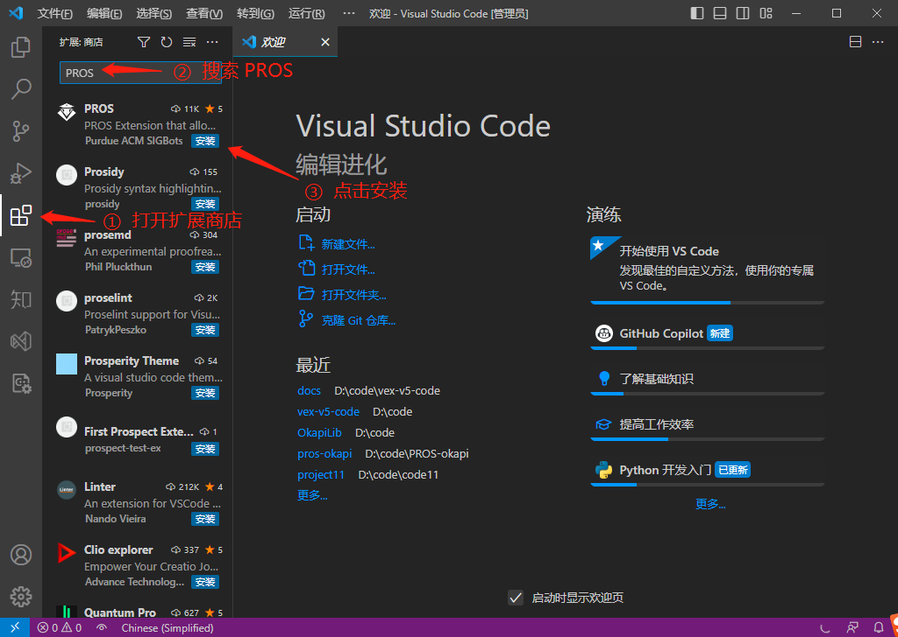
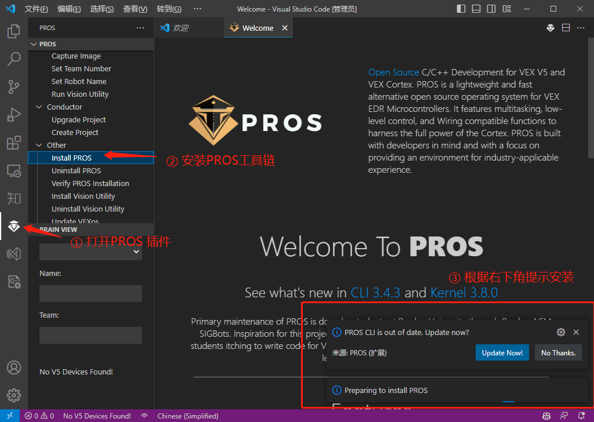
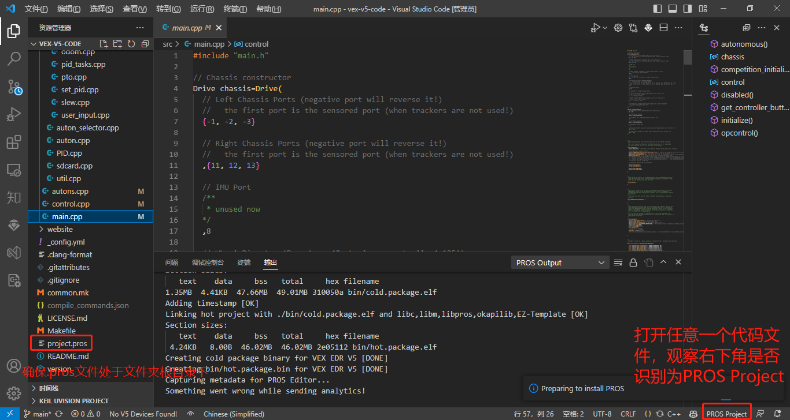
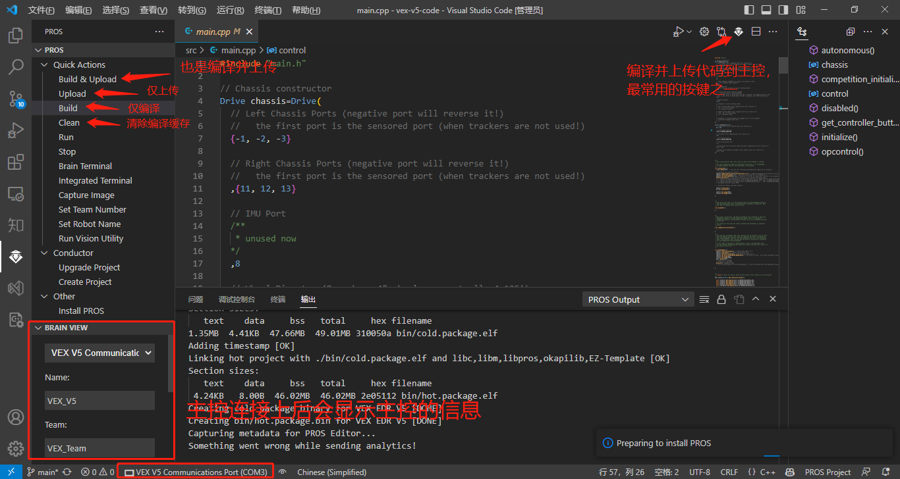
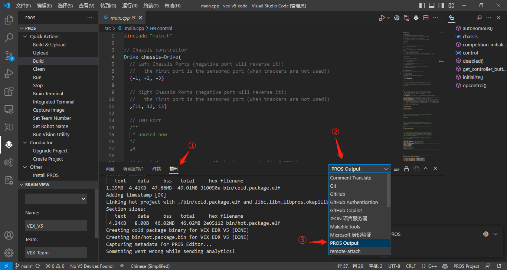
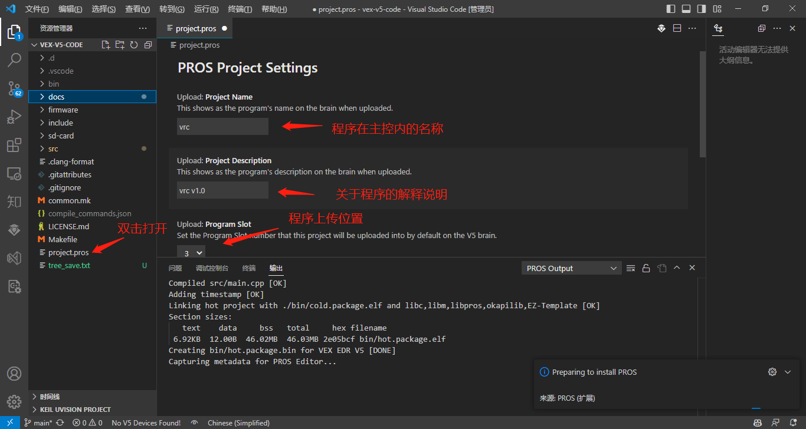
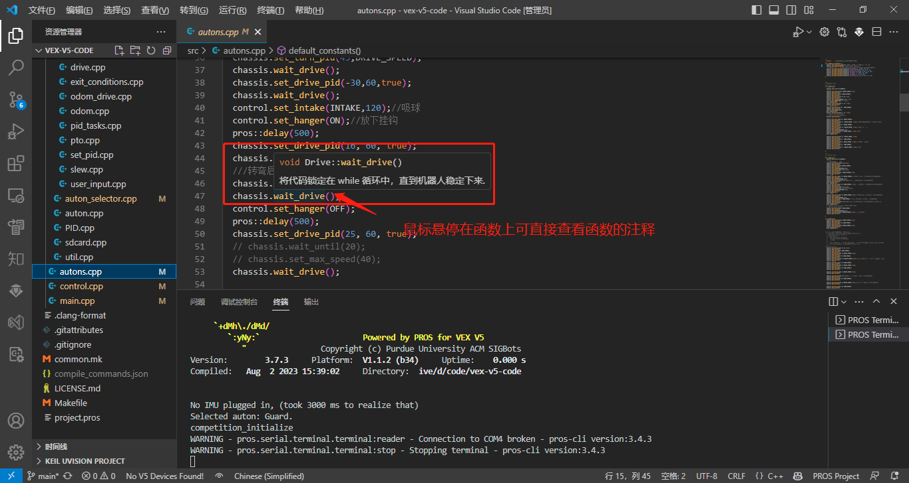

- **为方便说明，以下文档中将```Visual Studio Code```简称为```VSCode```。**
- **可能由于网络原因下载或安装失败，若失败请尝试科学上网**
# 简介
- 本程序依赖于PROS，使用```C/C++```编写代码，使用的```C++```版本为```C++17```，PROS的底层采用FreeRTOS，能保证系统的实时性与可靠性，由于采用PROS作为项目依赖，代码编写自由度较高，可拓展性较强。
- 本程序实现的主要功能有：
  1.使用pid+陀螺仪进行底盘控制，能实现精准的底盘控制。
  2. 采用程序选择器选择自动阶段运行的程序，便于场上调整。
  3. 已实现上层机构的功能,能灵活控制各机构，完成场上功能。 

# 编程环境的搭建和使用方法

## PROS的下载与安装

1. 打开VSCode官网[(点击这里)](https://code.visualstudio.com/)，下载并安装VSCode。
2. 打开VSCode，如图所示，下载PROS插件。

3. 打开PROS插件，安装PROS工具链。

4. 等待安装完成。

## PROS插件的使用方法
### 打开项目
- 打开VSCode
- 左上角选择文件-打开文件夹
- 打开PROS项目所属文件夹
- **确认是否已正确打开PROS项目，如下图所示**


### PROS插件常用功能
- 如图所示


### 查看PROS输出信息（如编译信息）
- 在输出窗口选择PROS OUTPUT ，可查看PROS终端输出的信息，如编译进度，上传进度等提示

- PROS在右下角弹出的输出信息并不会自动消失，**请手动关闭消息**，防止因消息过多导致无法获取有效信息。
### PROS API 大全
PROS API HOME[点击这里](https://pros.cs.purdue.edu/v5/api/index.html)

### 常见问题
1. Q：右下角一直显示 Preparing to install PROS
   A：**插件的小BUG，只要PROS插件各功能正常，如编译、上传等功能便无需理会**
2. Q: 程序打开后出现乱码的现象
   A：
    ① 打开```文件-首选项-设置```
    ②```用户-常用设置-文本编辑器-文件-Encoding```
    ③ 将Enconding改为```UTF-8```
    

### PROS 项目的配置
双击project.pros文件即可打开PROS项目的配置界面，可配置项目在主控上的名字、注释、上传位置、图标等



### 无线传输
- 主控与遥控器的连接方法可以[参考这里](https://vexrobot.cn/wiki/2)
- 在将遥控器连接上电脑后，VSCode左下角状态栏会显示```VEX V5 Controller Port``` 设备，则表示遥控器已连接上，此时即可将代码通过遥控器上传至主控。
  - **需要注意的是，在某些情况下使用遥控器传输会较慢，此时VSCode右下角会有所提示，请根据实际需求选择无线或有线传输**
  - 想要更进一步的了解PROS无线传输有关知识，可[参考这里](https://pros.cs.purdue.edu/v5/tutorials/topical/wireless-upload.html)
## 给项目添加新代码文件(cpp/hpp)
若想给项目添加一些新的代码文件，可按照以下步骤进行。
1. 请在```/include```目录添加相应的```.hpp```文件，在```/src```目录添加相应的```.cpp```文件。
2. 在```/include/main.h```中，在
  ```cpp
  // More includes here...
  ```
  后include相应的头文件。
3. 在```.hpp```文件中的第一行，**添加宏定义**
  ```cpp
  #pragma once
  ```
## 安装插件：C/C++
- C/C++是由微软推出的插件，为VSCode添加了对C/C++的语言支持，包括编辑（IntelliSense）等功能。安装此插件后可提高代码阅读效率及开发效率。
- 安装方法：同PROS插件安装方法，在拓展商店搜索C/C++后点击安装即可。
- 鼠标悬停在函数上即可查看函数的注释。

- ```鼠标左键点击函数+ctrl```可直接跳转到函数的声明

# 代码的整体结构说明
本代码中，所有类、函数的声明均在```/include```中，所有的实现均在```/src```中，代码的整体架构如下：
```
│  .clang-format
│  .gitattributes
│  .gitignore               
│  common.mk                编译配置文件
│  compile_commands.json    
│  LICENSE.md
│  Makefile                 编译配置文件，无需改动
│  project.pros             PROS项目配置文件
│  
├─.d                        编译生成的文件目录
├─.vscode                   VSCode配置文件目录
├─bin                       编译生成的文件目录
├─docs                      代码相关文档
├─firmware                  编译所依赖的静态库
├─include                   头文件目录
│  │  api.h                 PROS api
│  │  autons.hpp            自动阶段函数声明
│  │  control.hpp           上层机构Control类声明
│  │  main.h                包含整个项目中所使用的通用定义和头文件
│  │  
│  ├─display                UI(LVGL)头文件
│  │                        
│  ├─EZ-Template            模板头文件目录
│  │  │  api.hpp            模板 api
│  │  │  auton.hpp          程序选择器声明
│  │  │  auton_selector.hpp 程序选择器声明
│  │  │  PID.hpp            PID类声明
│  │  │  sdcard.hpp         sdcard相关声明
│  │  │  util.hpp           一些编程时会用到的工具函数声明
│  │  │  
│  │  └─drive               底盘运动相关头文件目录
│  │          drive.hpp     底盘运动Drive类声明
│  │          odom.hpp      Odometry定位声明
│  │          
│  │                      
│  └─pros                   PROS库函数
│                           
│      
└─src                       代码实现目录
  │  autons.cpp             自动阶段函数实现
  │  control.cpp            上层结构控制实现
  │  main.cpp               程序的开始，main.cpp
  │  
  └─EZ-Template             模版的实现
      │  auton.cpp          程序选择器
      │  auton_selector.cpp 程序选择器
      │  PID.cpp            PID实现
      │  sdcard.cpp         sdcard使用
      │  util.cpp           工具函数实现
      │  
      └─drive               底盘运动实现
              drive.cpp     底盘控制函数
              exit_conditions.cpp   pid退出条件
              odom.cpp              Odometry实现
              odom_drive.cpp        Odometry实现
              pid_tasks.cpp         pid线程的实现
              pto.cpp               pto底盘
              set_pid.cpp           pid设置 
              slew.cpp              pid缓加速
              user_input.cpp        控制器相关
```

# 在程序内配置端口与参数
## 配置底盘参数及底盘电机端口
1. 使用VSCode打开VEX-VRC-Code-v1.0文件夹，并检查是否已正确打开为PROS项目。
2. 打开src/main.cpp文件。
3. 找到```Drive chassis```变量，根据注释配置相关参数。

## 配置上层结构端口
1. 打开src/main.cpp文件
2. 找到```Control control ```变量，根据注释配置相关参数。

# 使用竞赛模板编写代码
- 打开src/main.cpp文件，文件内有以下函数
  ```cpp
    void autonomous(void);
    void initialize(void);
    void disabled(void);
    void competition_initialize(void);
    void opcontrol(void);
    std::vector<int32_t> get_controller_button();
  ```
- ```void autonomous(void)```函数将会在自动阶段开始时自动运行。
- ```void opcontrol(void)``` 函数将会在手动阶段开始时自动运行。
- 无论在何种情况下，```void initialize(void)```函数总是在程序刚启动的时候就执行。
- ```void disabled(void)``` 函数将会在竞赛场控**切换到**```DISABLE```模式时调用。
- ```void competition_initialize(void)```函数只有在连接竞赛场控时才会运行，且将在竞赛开始后自动退出。
- ```std::vector<int32_t> get_controller_button()```函数用于获取控制器上的按钮状态
- **==注意==**：在竞赛开始前无法控制电机，即在连接上场控模块后，除
  ```cpp
    void autonomous(void)
    void opcontrol(void)
  ```
  函数外，所有试图控制电机的操作都是无效的。

# 底盘控制
## PID参数的整定

## 如何让底盘运动
控制底盘的函数主要有以下几个：
```cpp
    /**
   * 使用PID让机器人前进/后退指定距离
   *
   * \param target
   *        目标值（英寸）
   * \param speed
   *        0 to 127, 机器人运动时的最大速度
   * \param slew_on
   *        是否启用缓加速，默认关闭
   * \param toggle_heading
   *        是否使用陀螺仪修正前进方向，默认开启
   */
  void Drive::set_drive_pid(double target, int speed, bool slew_on = false, bool toggle_heading = true);


    /**
   * 使用PID让机器人原地转向到指定角度
   *
   * \param target
   *        目标角度（角度制）,0度为机器人加载程序时所对的角度，
   * \param speed
   *        0 to 127, 机器人运动时的最大速度
   */
  void Drive::set_turn_pid(double target, int speed);


    /**
   * 仅使用左侧或右侧转动。
   *
   * \param type
   *        L_SWING 或 R_SWING
   * \param target
   *        目标角度（角度制）
   * \param speed
   *        0 to 127, 运动时的最大速度
   */
  void Drive::set_swing_pid(e_swing type, double target, int speed);


  /**
   * 将代码锁定在 while 循环中，直到机器人稳定下来。
   */
  void wait_drive();


    /**
   * 将代码锁定在 while 循环中，直到走过指定路程。
   *
   * \param target
   *        当直线行驶时，单位是英寸。当转弯时，单位是角度（角度制）
   */
  void wait_until(double target);
```
关于以上函数如何使用，可以参考autons.cpp中的使用方法。
# 上层机构的控制
上层机构的控制，主要在```/src/control.cpp```中实现，各函数的声明和注释均在```/include/control.hpp```中。如何使用这些函数可以参考```/src/main.cpp```中的```void opcontrol()```函数。

# 快速开发
1. 在```/src/main.cpp```中配置机器人的端口，如底盘电机、陀螺仪、电磁阀等设备的端口。
2. 在```/src/main.cpp```中的```void opcontrol()```函数中根据需求更改控制器按钮所对应的功能
3. 根据需求更改```/src/control.cpp```中的函数
4. 在```src/autons.cpp```和```/include/autons.hpp```中添加或修改自动任务所对应的函数。
5. 在```src/main.cpp``` ```   void initialize()```函数里的
```cpp
  ez::as::auton_selector.add_autons({
    Auton("Guard.", auton_1),
    Auton("Attack.", auton_2),
    Auton("1min. ", auton_3),
  });
```
上添加自动任务函数（若有）。
例如我要添加```void test()```函数，要在屏幕上显示的文字是```is a test program```,则这样添加：
```cpp
  ez::as::auton_selector.add_autons({
    Auton("Guard.", auton_1),
    Auton("Attack.", auton_2),
    Auton("1min. ", auton_3),
    Auton("is a test program",test),
  });
```

